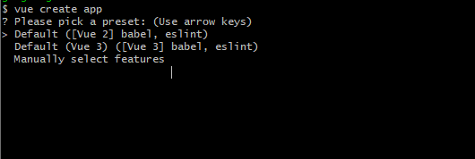
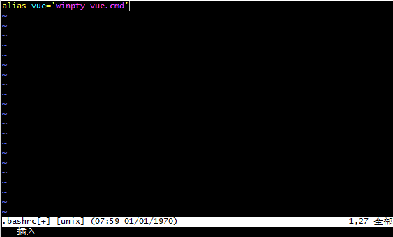
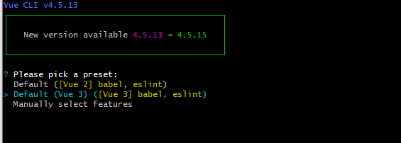

在 Windows 系统中，当我们在命令行工具 git bash 中使用 `vue create app` 这个命令进行新项目创建时，会出现以下选项提示：



让我们选择具体的选项，但实际上并不能进行选择，这个问题及解决方案在 Vue CLI 的官方文档都有[详细说明](https://cli.vuejs.org/zh/guide/creating-a-project.html#vue-create)。即：
> 你必须通过 winpty vue.cmd create hello-world 启动这个命令。不过，如果你仍想使用 vue create hello-world，则可以通过在 ~/.bashrc 文件中添加以下行来为命令添加别名。 alias vue='winpty vue.cmd' 你需要重新启动 Git Bash 终端会话以使更新后的 bashrc 文件生效。

在 git bash 中创建 ~/.bashrc 并写入相应内容的详细流程如下：

首先通过 vim 命令新建 .bashrc 并进入编辑页面：

```sh
vim ~/.bashrc
```
然后在编辑页面输入 `i` 进入输入模式，然后使用 `Shift` + `ins` 组合键将 `alias vue='winpty vue.cmd'` 粘贴进去，



最后使用 `Esc` 退出编辑模式，输入`:wq` 保存退出。再重启 git bash 后，再次运行 `vue create app` 即可使用上下翻页按钮进行选项选择了：



**其实吧，如果不用 git base 进行创建的话，改用 cmd 或者 git cmd 在不做上述配置的情况下，就可以直接使用上下翻页按钮进行选择的~**